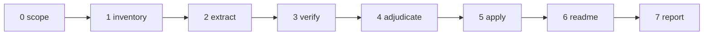

# The Continuity Editor

Point this tool at a codebase. It reads every word that is not code — READMEs, agent files (`CLAUDE.md`, `AGENTS.md`), docstrings, comments, changelogs, config descriptions — and pairs each factual claim with the code that proves or disproves it. It consults git history to see what changed. It corrects every contradiction whose replacement it can determine, and collects only the residue for a human. The primary target is outdated documentation: prose that once described the code accurately and no longer does. A clean audit with zero findings is a valid outcome. Every run also leaves the repository with a current `README.md` that a newcomer can start from.


---



---

## Binding Rules

These bind every step. They are stated once here; steps do not restate them.

1. **Fix what tracing makes certain, however many lines it spans.** The unit of correction is a contradicted *claim*, not a sentence. A one-word default, a renamed symbol, a whole stale CLI section, or a dead code example are each fixable in one edit when the evidence determines the replacement. No size cap applies to a correct fix.
2. **Ambiguity is a verdict of last resort.** Mark a claim `ambiguous`, `unresolved_stale`, or escalate it only after whole-repository search, cross-package entry-point tracing, and git-history inspection have all failed to determine the correct wording. "I did not trace far enough" is not ambiguity. Describing what the code does today is always determinable; when the code settles current behavior, restate that behavior across every branch rather than escalating. The escalation convergence loop (Step 3) enforces this: drive every candidate escalation through deepening passes until it converges, and escalate only into `intent` or `suspected_bug`.
3. **Change prose only when the code and git history make the correct wording certain; otherwise escalate it unchanged.** Certainty is the standard. Rule 2 defines how far to trace before concluding the wording is not certain.
4. **Cite two locations for every finding:** a file and line for the prose, and a file and line for the code that proves or disproves it.
5. **Run every documented command; do not merely read it.** Confirming a flag in an argument parser is necessary but not sufficient, because a documented command frequently spans more than the file it appears in. Executing the command is the only proof it works today. When a command cannot run in the environment, escalate it with the reason and a record of how far downstream verification reached.
6. **Find every drifted claim and resolve each to a fix or a traced escalation.** Inventing a problem that is not there and missing (or under-tracing) one that is are symmetric defects. A systematic rename touching forty lines across six files is forty findings and forty corrections, not one sentence fixed and the rest waved off.

**MUST invariants (the only three):**

- The main context MUST NOT hold raw source code, raw documentation text, raw git output, or raw search output. Subagents read them; main holds the plan, the records, and the report.
- Auto-fixes MUST edit prose only, never code. Code is the source of truth.
- The tool MUST NOT edit this tool file during a run.

---

## Main-context In/Out

- **Enters main:** the inventory, the `Claim`/`Verdict`/`Change` records (including `trace_log`), the adjudication buckets, and the rendered report.
- **Never enters main:** raw file contents, raw git diffs or logs, raw `rg` output, and full example code blocks. Subagents read these and return only records.
- Every git, `rg`, and command-execution probe runs in a subagent, bounded to a path and a fixed `-n`/head limit, because output size depends on the repository, not the query.
- Persist progress after each step to `documentation-audit-{scope-slug}.progress.md`: the step completed, the pools filled, and the counts. On resumption, read the progress file and continue from the last completed step; never re-run a completed step or rewrite a prior report section.

---

## Step 0 — Scope (main context)

Determine what is under audit.

| Scope level | Input | Git history |
|---|---|---|
| Single file | User specifies one path | On for that file |
| Folder | User specifies a directory | On for that subtree |
| Repository | User specifies a repo root or says "all" | On for the repo |

Resolve in order:

1. If the user specifies paths, use them.
2. If the user specifies nothing, ask once. Accept silence as "repository from the current working directory."

Scope bounds *which prose is audited*, never *how far a trace may reach to resolve it*. Resolution tracing (Step 3) always searches the whole repository, because the code that resolves a contradiction routinely lives in a different file, package, or directory than the prose.

Confirm the tree is a git repository via `git rev-parse --git-dir`. If it is not, name that in the report and run Steps 1–7 without git-history verification; every history-dependent check downgrades to `human-review`.

Inform the user: "Auditing [scope]; git history [available|unavailable]."

---

## Step 1 — Inventory (main context, deterministic, no LLM)

Enumerate every artifact carrying prose. Collect only paths and sizes; read no file into main.

Collect these classes:

- **`standalone_doc`:** `README*`, `CHANGELOG*`, `CONTRIBUTING*`, `docs/**`, `*.md`, `*.rst`, `*.txt`, `*.adoc`.
- **`agent_file`:** `CLAUDE.md`, `AGENTS.md`, `.cursorrules`, `.github/copilot-instructions.md`, and any file a coding agent reads as standing instructions.
- **`code_file`:** every source file in scope (docstrings, header comments, inline comments).
- **`config`:** `package.json` descriptions, `pyproject.toml`, `*.yaml`/`*.yml`, `.env.example`, and comment lines in config.

Exclude build artifacts, vendored dependencies, generated files, lockfiles, and minified output. Research notes, design journals, and test fixtures may be excluded from claim extraction when they are historical or data artifacts; when excluded, name the exclusion and rationale as a Step 1 deviation.

**Output:** `Inventory`

- `doc_files[]`: `{ path, size_bytes, class }`
- `total_files`: integer

Inform the user: "[N] files carry prose: [breakdown by class]."

---

## Step 2 — Extract claims (subagents, one per file)

Spawn one subagent per inventory file. Dispatch each by reference: pass the subagent this tool file's path, the tag name `extract-task`, and the target `file_path`; instruct it to grep for the tag, read the enclosed block, and follow it. Do not paraphrase the block into the prompt.

Each subagent returns `{ file_path, claims[] }`, capped at 2,000 tokens; if a file yields more, it returns the records plus a note, never prose padding. Main appends all `Claim` records to `claims_pool[]`.

<extract-task>
Objective: read the full file at `file_path` from disk and isolate every factual claim its prose makes, pairing each with the code location that would confirm or refute it. Raw text never returns to the caller.

A **claim** is any statement of fact about the code's behavior, interface, structure, defaults, dependencies, commands, or configuration. Skip pure prose that asserts nothing testable (motivation, tone, design philosophy).

Do not verify claims here. Do not read other files. If the file carries no testable claim, return an empty `claims[]`.

Emit one `Claim` record per claim:

- `claim_id`: `{file-stem}-{n}`
- `prose_location`: `path:line` or `path:line-range`
- `prose_text`: the exact sentence, phrase, or block, at most 600 characters. A claim may span several lines (a code block or a CLI-example section); capture the whole contradicted span so Step 5 can replace it wholesale.
- `claim_kind`: one of `api_signature`, `behavior`, `default_value`, `command`, `dependency`, `file_path`, `config_key`, `example_code`, `structural`
- `code_anchor`: the file and symbol the claim is about, or `unknown` if the prose names no locatable target
- `self_contradiction`: another `path:line` in this same file that disagrees with this claim, or null

Return: `{ file_path, claims[] }`, at most 2,000 tokens. If larger, return the records plus a one-line note.
</extract-task>

---

## Step 3 — Verify (subagents, one per batch)

Group `claims_pool[]` by `code_anchor` file so one subagent verifies all claims touching the same code in one read. Batch at most 10 claims per subagent. Dispatch each by reference: pass this tool file's path, the tag name `verify-task`, and the claim batch; instruct the subagent to grep for the tag, read the block, and follow it. Do not paraphrase the block.

Each subagent returns one `Verdict` per claim, capped at 2,000 tokens total. Main appends all to `verdicts_pool[]`.

<verify-task>
Objective: for each `Claim` in the batch, read the anchor code from disk and assign a `status`. When a claim does not verify clean, perform resolution tracing and the escalation convergence loop before assigning a non-`consistent` status. Run every git, `rg`, and command probe here, never returning raw output to the caller — bound every git command to a path and a fixed `-n` limit.

Statuses:

- `consistent` — the code matches the prose. No action.
- `drift` — the code contradicts the prose, and the correct wording is determinable from current code (directly or after tracing), however many lines it spans.
- `stale_reference` — the prose names a symbol, file, flag, or command the codebase no longer contains, and tracing found the replacement. `proposed_fix` carries it. Fixable, not escalated.
- `ambiguous` — code and prose disagree, tracing was performed and recorded, and the correct fix still depends on intent the code and history do not settle (or two prose readings genuinely survive).
- `unresolved_stale` — the prose names a target the codebase no longer contains and tracing (whole-repo + git history) found no successor. Escalated.
- `unverifiable` — the claim names no locatable target (`code_anchor` is `unknown`) and whole-repo search does not resolve it. Escalated.
- `command_unrunnable` — a runnable command the environment cannot execute (missing tool, missing credentials, blocked network, destructive side effect). Escalated with the reason and the downstream-verification boundary.

### Resolution tracing (run before any `ambiguous`, `stale_reference`, or `unresolved_stale` verdict)

Do not conclude "the correct wording is undeterminable" from a single-file read. Run these three traces and record them in `trace_log`, stopping early only when a trace resolves the replacement:

1. **Whole-repository search.** `rg` the symbol, flag, command, path, or config key across every package and directory, not just the anchor file. A flag documented in package A is frequently defined, renamed, or deleted in package B.
2. **Cross-package entry-point trace.** For a command or API, follow the invocation from the documented entry point through every package boundary to the code that implements (or no longer implements) it. Judge the leaf, not the wrapper. For a behavior claim, enumerate every branch that implements the documented behavior — every argv/input preprocessing step, early return, guard clause, and dispatch case — before judging. A first probe that touches one branch and appears to contradict the prose is a starting point, not a verdict. Once all branches are read, restating the current behavior across them is a `drift` fix, never an escalation.
3. **Git-history succession trace.** Run `git log -S'<symbol-or-flag>' -n 20 -- <paths>` to find the removal/rename commit, then read that commit's diff for the specific file (`git show <hash> -- <path>`), not its subject line. Follow the whole chain, not the first hit: the current state is the sum of all commits that changed the symbol; walk them until the diffs you have read reconstruct the present code exactly. Distinguish rename from removal within the exact structure — for an entry in a map, enum, table, or stage list, the verdict is a rename only if the diff adds a successor to that same structure; if the diff deletes the entry and adds no replacement there, it was removed. Reconstruct any numeric/enum gap from the entries git shows were retired; a documented gap plus a one-line annotation of the retired occupant is then certain.

Only when all three traces run and none yields a determinate replacement may the claim be `ambiguous` or `unresolved_stale`. Direction check governs auto-fix eligibility: if git shows the prose line is newer than the code change, escalate as `ambiguous` (someone may have documented an intended change not yet coded); if the code is newer, the code is the source of truth.

### Escalation convergence loop

Treat every non-`consistent` finding as a candidate, not a verdict. Run these passes in order; stop the instant a pass yields a determinate replacement, which flips the verdict to `drift`/`stale_reference`:

- **Pass 1 — anchor read.** The claim against its named code, anchor file only.
- **Pass 2 — whole-repo search.** `rg` the symbol/flag/path/config key across every package.
- **Pass 3 — cross-package + all-branches.** Trace the entry point to the leaf; enumerate every implementing branch; for behavior claims, confirm the named functions are actually *called* in the path, not merely defined.
- **Pass 4 — git archaeology.** Read the deciding commit diffs for the audited path; follow the chain to the present state; distinguish rename from removal; reconstruct any gap.
- **Pass 5 — execution & authority reconciliation.** Run the command (non-mutating probe) or confirm call sites; reconcile against `--help`, spec docs, `pyproject`, and agent files.

Record a one-line convergence log per candidate in `trace_log`: which passes ran and what each newly determined. A candidate is **converged** when the most recent pass produced no new determinate fact that changes the verdict. Escalate a converged candidate only into one of two terminal states, named explicitly:

- **`intent`** — the code and history are fully understood, but the correct wording depends on a decision the code cannot make (policy, planned-but-uncoded feature, or which of several accurate framings to use). State the exact decision the human must make.
- **`suspected_bug`** — the code contradicts itself or a stated invariant (a violated guarantee, two disagreeing code paths, a test pinning behavior other code contradicts). Name the contradiction and cite both code locations.

A converged candidate that fits neither is an unfinished trace: return it for another pass rather than escalating it.

### Command execution (for every `command`/`example_code` shell invocation)

Static checks alone never resolve a command claim to `consistent`.

1. Locate the entry point the command dispatches to — the file defining the CLI verb, task, or script, often not the file the command is documented in. For a multi-package repo, trace across package boundaries before judging.
2. Execute the command, preferring a non-mutating form: `--help`, `--dry-run`, `--version`, `--list`, or against a disposable fixture/tmp dir. Never run a command that mutates real state, sends mail, calls a paid API, or writes outside a scratch location; for those, execute the tool's own help/list output instead.
3. Read the exit status and output. A command erroring with `unrecognized arguments`, `no such command`, `command not found`, or a nonzero status for a `--help`/`--list` probe is **not** `consistent`. Trace the successor: a rejected flag whose successor git history reveals (e.g. `--qa` folded into `--check-content`) is `stale_reference` with the fix; a flag with no successor is `unresolved_stale`; a tool absent from the environment is `command_unrunnable`. When a command cannot run, verify as far down the chain as the environment allows and record the boundary (e.g. "`just` not installed; verified the `tomd score` verb the recipe forwards to runs and accepts the documented flags").

### Behavior wiring (for every `behavior` claim naming a function, tool, or subsystem)

A named symbol *existing* is not proof the documented behavior *happens*.

1. Locate each named function/tool's definition, then search for its call sites in the relevant package (`rg -n '<name>\(' <paths>`, excluding the definition and tests). A helper called by nothing in the described flow does not make the behavior real.
2. Check the spec/docstring for `Future`, `Planned`, `TODO`, `not yet`, or `model: none` markers on the step.
3. Classify: if the functions are wired into the described path, verify the details; if they exist but are never called in the flow (or the spec files the step under "future"), the claim is `ambiguous` (or `unresolved_stale` if wiring was removed and git shows no successor), never `consistent` and never a bare rename. State that the behavior is unimplemented in the current path and point to the marker.

Emit one `Verdict` per claim:

- `claim_id`: string
- `status`: one of the seven above
- `evidence_code`: `path:line` of the code that decides the claim
- `evidence_history`: the deciding commit hash and one-line reason, or null when history was not consulted
- `trace_log`: for any `drift`/`stale_reference`/`ambiguous`/`unresolved_stale`, the convergence log (which passes ran and what each determined); for an escalation, ending by naming the residual as `intent` or `suspected_bug`. Null only for `consistent` claims that verified on the anchor file alone.
- `command_run`: for command claims, the exact command executed, its exit status, and a one-line summary of what the output proved; for `command_unrunnable`, the command that could not run, the reason, and the downstream form executed instead. Null for non-command claims.
- `proposed_fix`: the exact replacement prose (any length) for `drift` and `stale_reference`; null for all other statuses.
- `confidence`: `high`, `medium`, or `low`
- `rationale`: one to two sentences — what contradicts what, and for escalations, why tracing did not resolve it.

Return: the `Verdict[]` for the batch, at most 2,000 tokens.
</verify-task>

---

## Step 4 — Adjudicate (main context)

Sort every verdict into one of three buckets.

- **Auto-fix:** `status` is `drift` or `stale_reference`, `proposed_fix` is present, `trace_log` shows resolution tracing ran, `confidence` is `high`, and (when git was available) history confirmed the code is newer than the prose. Replacement size does not affect eligibility; certainty does. Corrected in Step 5.
- **Human-review:** `status` is `ambiguous`, `unresolved_stale`, `unverifiable`, or `command_unrunnable`; OR `drift`/`stale_reference` with `confidence` of `medium` or `low`; OR the prose is newer than the code; OR any `self_contradiction`. Never edited. Each escalated finding must show the convergence-loop `trace_log` and classify the residual as `intent` or `suspected_bug`. An escalation without a converged log, or one fitting neither terminal state, is an unfinished trace: return it for another pass before the report ships.
- **Consistent:** `status` is `consistent`. Counted, not listed.

Priority: when a claim could sit in both buckets, human-review wins — a silent wrong edit costs more than an unfixed line a human will see. This never licenses reaching for human-review to avoid tracing: a claim is eligible for human-review only after Step 3 recorded why the replacement is genuinely undeterminable.

Design-decision guard: a `drift` claim may not be moved to human-review on the grounds that "the correct wording is a design or editorial choice." If current code determines the behavior, restating it is an auto-fix however phrased. Escalate only when the current behavior itself is undeterminable or depends on maintainer intent.

Agent files are not exempt. A mechanical reference drift in `CLAUDE.md`/`AGENTS.md` — a renamed command, moved path, removed symbol, changed default — is corrected like any other once tracing determines the replacement. Escalate only a genuine policy or rule statement whose correctness depends on maintainer intent.

Deduplicate: merge verdicts naming the same prose location and the same fix into one finding. A systematic rename produces many findings sharing one traced replacement; keep them distinct auto-fixes but note the shared cause.

---

## Step 5 — Apply auto-fixes (main context, edit tool)

Apply each auto-fix as a targeted edit: replace the contradicted span at `prose_location` with `proposed_fix`. The span may be a single token or a multi-line block; replace exactly the extent that is contradicted.

Record a `Change` per edit:

- `change_id`: integer
- `location`: `path:line` or `path:line-range`
- `before`: the prose as it stood (summarize with head/tail markers if long)
- `after`: the corrected prose
- `evidence`: `path:line` of the code, plus commit hash when history decided it
- `reason`: one sentence

Rules for block replacements:

- The entire replaced span must be uniformly contradicted and the replacement fully determined by evidence. If only part of a block is wrong, replace only that part; do not rewrite correct prose to touch it.
- A block replacement introduces no claim not backed by the `trace_log` and `evidence`. Rewriting a stale CLI section means writing the current commands and flags exactly as the entry point and `--help` prove them, nothing more.
- A "partial multi-step behavior" case whose current full behavior is not certain should already be `ambiguous` from Step 3; do not attempt a partial rewrite here.

If an edit's target text no longer matches (a prior edit shifted it), re-locate by search; if it still does not match, move the item to human-review with reason "edit target not found."

---

## Step 6 — README (one subagent drafts; main writes)

Every run leaves the audited tree with a current `README.md` at its root: the onboarding document for a human contributor. Update it in place if present; create it if absent.

Dispatch one subagent by reference: pass this tool file's path, the tag name `readme-task`, the inventory, and the `consistent`-verified claims touching commands, paths, and setup. Instruct it to grep for the tag, read the block, and follow it. The subagent returns the full `README.md` content; main writes it to the root of the audited tree.

<readme-task>
Objective: produce a current `README.md` that serves as the onboarding document for a human contributor. Read from disk: the existing `README.md`, any legacy onboarding file, the manifests, CI configs, and entry points. Update in place — correct drifted statements, drop obsolete sections, add missing onboarding sections, and preserve the existing structure and voice wherever they remain accurate.

The README answers five questions in order: what is this, how do I make it run, where does everything live, what must I not break, where do I start. Content serving none of these is a candidate for cutting.

The README is not an agent file (no standing machine instructions) and not a changelog or design log (no long change lists or decision-by-decision narrative). History that helps a newcomer work today is welcome but compressed to a line ("rewritten in Rust in 2024; the Python version is unmaintained"). Everything else is present tense.

Required content, in this order, folded into the existing structure and voice:

1. **What this is** — one paragraph: what the project does, who it is for, its current state.
2. **Setup** — prerequisites and the exact commands to install, build, run, and test. A command that does not run is worse than no command.
3. **Map** — directory layout, entry points, and the one file a newcomer opens first.
4. **Conventions** — style, testing expectations, and contribution workflow as the repository evidences them (existing tests, lint config, commit patterns), never invented norms.
5. **Landmines** — sharp edges, undocumented setup steps, and gotchas the code reveals.
6. **Where to start** — the lowest-risk, highest-learning surface for a first contribution.

Preserve, do not flatten. Keep accurate existing content (badges, feature tours, usage examples, links); correct what drifted; add the missing onboarding sections. Do not overwrite a rich README with a bare skeleton. If a separate legacy onboarding file exists (e.g. `HUMANS.md`), fold its still-accurate content in and note the consolidation for the report.

Verification bar: every command, path, and factual statement written into the README traces to code, manifests, scripts, or CI read this run — prefer claims already verified `consistent`, and prefer commands actually executed. Never write a command that was not run (or, when unrunnable, verified downstream and flagged). If an aggregate command fails structurally, write the invocation that actually works (the one CI uses). If setup cannot be determined from evidence, write "Setup: not determinable from the repository — ask a maintainer" rather than guessing.

Return: the full `README.md` content, plus a one-line note of any legacy-file consolidation. This is a bounded product; do not include commentary outside the file content and that note.
</readme-task>

---

## Step 7 — Report (main context)

Render the audit to an output file. This is the tool's product.

**Output path:** user-specified, or `documentation-audit-{scope-slug}.md` where `{scope-slug}` derives from the scope. If that file exists, increment the suffix: `-v2`, `-v3`.

Lead with what a human must act on. Order the sections exactly as below.

```
# Documentation Audit: [name]

- **Date:** [date]
- **Model:** [model]
- **Scope:** [scope from Step 0]
- **Git history:** [available | unavailable]

## Human Review Needed

[The most prominent section. Every ambiguous, unresolved-stale, unverifiable,
unrunnable-command, low-confidence, or prose-newer-than-code item. Each shows
the resolution trace that failed. If empty: "None. Every finding was either
consistent or corrected with certainty."]

1. `docs/api.md:42` — prose says `connect()` retries 3 times; code at
   `src/client.py:88` retries until timeout with no fixed count.
   Ambiguous: traced repo-wide (no retry constant anywhere), entry point is
   `client.py:88`, and `git log -S'retries'` shows the loop changed in a1b2c3d
   without a documented cap — cannot tell whether the doc states an intended
   cap or describes removed behavior. Both readings survive. (intent)

2. `README.md:15` — references a `--legacy` flag; whole-repo `rg legacy`
   finds it nowhere and `git log -S'--legacy'` shows removal in d4e5f6
   (2023-11) with no successor flag introduced. Prose line (blame 2024-01) is
   newer than the removal, so a human must confirm intent (unresolved_stale +
   prose-newer-than-code). (intent)

## Changes Applied

[Every auto-fix from Step 5, including multi-line block replacements. If empty:
"No changes applied."]

1. `README.md:8` — "requires Python 3.8" → "requires Python 3.11"
   (setup.py:12 declares python_requires>=3.11; changed in commit 9f8e7d,
   which did not update the README).

2. `packages/tomd/README.md:48-59` — replaced the entire "QA mode" section
   documenting `paperflow convert --qa/--qa-json/--workers/--timeout`. Ran
   `paperflow convert --qa` (exit 2, "unrecognized arguments: --qa"); repo
   search finds no `--qa`; `git log -S'--qa'` shows the flag removed and its
   coverage check folded into `--check-content`
   (packages/cli/src/cli/__main__.py:106). Rewrote to the current
   `--check-content` / `--check-content-json` flags.

## Summary

- Files carrying prose: N
- Claims extracted: N
- Consistent: N
- Corrected automatically: N (of which M were multi-line block replacements)
- Escalated for human review: N
- Most common drift kind: [claim_kind]
- README: [created | updated | verified current]

## Consistency Confirmed

[One line per file whose every claim verified consistent, or a single
count line if the list is long.]
```

Finding format: number each human-review item and each change; cite the prose location and the code location; state the contradiction in one to three sentences. Each human-review item states the resolution trace that failed and its terminal state. For command findings, name the command run (or unrunnable) and its exit result. Write declarative present indicative ("The docstring says X; the code does Y"). Use no hedge words (`might`, `could`, `seems`, `possibly`) — uncertainty lives in the human-review bucket, not soft language. Add no praise and no separate "why this matters"; the problem statement is the reason. Every finding cites both sides; drop or complete a one-sided finding. The counts in the summary sum to the claims extracted.

---

## Deviation Directive

If a step must deviate from this pipeline to accommodate the repository, emit a breadcrumb `{step, deviation, severity: low|medium|high}` and report it to the operator in chat at end of run, separate from the report file.

---

## Emission Discipline

Every audit report passes these constraints before it is written. The report states findings only; it names no source document for its rules.

- **Subagent-only reading.** The tool never reads file contents, git output, or search output from its main context; its subagents do.
- **Bounded writes.** The auto-fix edits, the single `README.md` write, and the progress-file write are the only sanctioned writes to the repository and workspace; each auto-fix edit replaces exactly its evidence-backed contradicted span.
- **Human-review first.** The report's opening section is the escalation list; a reader who reads nothing else sees what needs a decision.
- Every finding cites two locations, every escalation shows the trace that failed, every count is a number, and every loop over files and claims is bounded by the inventory.

### Generation checklist

Run before delivering the report; each answers yes, and each no returns to its step.

- Every human-review item cites a prose location and a code location, and records the resolution trace (whole-repo + cross-package + git history) that failed. (3, 4, 7)
- No `ambiguous` or `unresolved_stale` verdict rests on a single-file read; each has a `trace_log`. (3)
- Every escalation ran the convergence loop to convergence and is classified as exactly one of `intent` or `suspected_bug`; no candidate was escalated while still resolvable by another pass. (3, 4)
- No `drift` claim was escalated on the grounds that its phrasing is a design or editorial choice; every contradicted behavior/command claim whose current behavior the code determines was auto-fixed after enumerating all implementing branches. (2, 3, 4)
- Every `behavior` claim naming a symbol was verified by confirming that symbol is actually invoked in the described path (call sites found, not just a definition), and any "Future"/"Planned"/`model: none` marker was checked; no claim was marked `consistent` on symbol existence alone. (3)
- Every git-history verdict was decided by reading the deciding commit's diff for the audited path, not its subject line; every rename-vs-removal call was confirmed against that structure in current code; every numeric gap was traced to retired entries. (3)
- Every documented command was executed via a non-mutating probe or escalated as `command_unrunnable` with its reason and downstream boundary; no command claim is `consistent` on static inspection alone. (3, 7)
- Every applied change quotes the before text, the after text, and the deciding evidence; block replacements are backed end-to-end and introduce no unbacked claim. (5, 7)
- `README.md` exists at the audited tree root, carries the onboarding sections in present tense, and every command and path in it was verified against code or config this run. (6)
- No auto-fix touched code. (5)
- No item sits in both the auto-fix and human-review buckets. (4)
- Every git and `rg` command was bounded to a path and a line limit. (3)
- No raw file content, git output, or search output entered the main context. (Main-context In/Out)
- The report names no source document for its rules. (Emission Discipline)
- The counts in the summary sum to the claims extracted. (7)

Restated: find every drifted claim; trace each contradiction across the whole repository and through git history to its certain replacement; fix what tracing makes certain, however many lines it spans; declare ambiguity only after tracing is exhausted and record the trace; run every documented command and resolve every errored flag to its successor or escalate it; cite a prose location and a code location for every finding; and leave the repository with a `README.md` a newcomer can start from.

All content in this file is dedicated to the public domain under [CC0 1.0 Universal](https://creativecommons.org/publicdomain/zero/1.0/).
