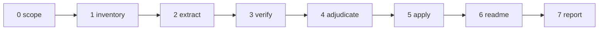

# The Continuity Editor

Point it at a codebase. It reads every word that is not code — READMEs, agent files like `CLAUDE.md` and `AGENTS.md`, module and class and function documentation, inline comments, changelogs, config descriptions — pairs each factual claim with the code that proves or disproves it, and consults `git` history to see what changed. It corrects every contradiction whose replacement it can determine and collects only the residue for a human. The largest quarry is outdated documentation: prose that described the code accurately once and no longer does. A clean audit with zero findings is a valid outcome. The tool goes out of its way not to invent problems — every finding names the exact contradiction — and equally out of its way not to *miss* them: a drifted claim left unfound, or a fixable claim lazily escalated, is the tool's primary failure. Every run also leaves the repository with a current `README.md`: a present-tense onboarding document that gives a human contributor everything they need to start working on the code today.


---



---

## Core Rule

Raw source code and raw documentation text NEVER enter the main context. All reading, all claim extraction, all verification, all tracing happens inside subagents. The main context holds the plan, the structured findings, and the final report. This keeps the attention budget spent on adjudication, not on payloads.

The four binding rules for this tool:

1. **Fix what tracing makes certain, however many lines it spans.** The unit of a correction is a contradicted *claim*, not a sentence. A one-word default, a renamed symbol, a whole stale CLI section, or a dead code example are all fixable in one edit when the evidence determines the replacement. There is no size cap on a correct fix.
2. **Ambiguity is a verdict of last resort.** A finding may be marked `ambiguous` or escalated as an unresolved `stale_reference` *only after* whole-repository search, cross-package entry-point tracing, and git-history inspection have all failed to determine the correct wording. "I did not trace far enough" is not ambiguity. A shallow single-file read that yields `ambiguous` is a defect. **Describing what the code does today is always determinable.** When the code settles the current behavior, the fix is to restate that behavior — however many branches it spans — and "the correct phrasing is a design or editorial choice" is never a valid reason to escalate a contradicted claim. Human-review is reserved for claims where *what the code does now* is genuinely undeterminable or turns on maintainer intent (policy, rationale, or a documented-but-not-yet-coded intention), not for claims the writer merely found awkward to word. Operationally this is enforced by the **escalation convergence loop** (Step 3): every candidate escalation is driven through successive deepening passes until it converges, and it may only escalate into one of two named terminal states — `intent` (a decision the code cannot make) or `suspected_bug` (the code contradicts itself or an invariant). A candidate that fits neither after a converged run is an unfinished trace, not an escalation.
3. **Change prose only when the code and git history make the correct wording certain; otherwise escalate it unchanged.** Certain is the standard, and Rule 2 defines how far you must trace before you are allowed to conclude the wording is *not* certain.
4. **Every finding cites a file and line for the prose and a file and line for the code that proves or disproves it.**

The execution rule: every documented command must be *run*, not merely read. Static verification — confirming a flag appears in an argument parser or a function exists — is necessary but not sufficient, because a documented command frequently spans more than the file it is documented in (a CLI verb defined in one package can invoke a library in another; a flag can exist in code yet never be wired to the entry point). Reading the wrong file yields a false `consistent`. Executing the command is the only proof it works today. When a command cannot be executed in the run environment, it is escalated with the reason and with a record of exactly how far downstream verification did reach.

The completeness rule: the tool must find *every* drifted claim in scope and resolve each to a fix or a traced escalation. The two ways to fail are symmetric — inventing a problem that isn't there, and missing (or under-tracing) a problem that is. Both are defects. A systematic rename (e.g. a package `dissect` renamed to `assay`) that touches forty lines across six files is forty findings to be found and, since the replacement is certain, forty corrections to be applied — not a single sentence fixed and the rest waved off.

---

## Deviation Directive

If any step must deviate from this pipeline to accommodate the repository, emit a breadcrumb: `{step, deviation, severity: low|medium|high}`. Report the deviations to the operator in chat at end of run, separate from the report file. Never edit this tool file from inside the run.

---

## Step 0 — Scope

Runs in main context. Determine what is under audit.

| Scope level | Input | Git history |
|---|---|---|
| Single file | User specifies one path | On for that file |
| Folder | User specifies a directory | On for that subtree |
| Repository | User specifies a repo root or says "all" | On for the repo |

Resolution order:

1. If the user specifies paths, use them.
2. If the user specifies nothing, ask once. Accept silence as "repository from the current working directory."

Regardless of the audited scope, **resolution tracing (Step 3) always searches the whole repository**, because the code that resolves a contradiction — the entry point a documented command dispatches to, the module a renamed symbol moved to, the flag that replaced a deleted one — routinely lives in a different file, package, or directory than the prose. Scope bounds *which prose is audited*, never *how far a trace may reach to resolve it*.

Confirm the tree is a git repository by checking for a `.git` directory or running `git rev-parse --git-dir`. If it is not a repository, name that in the report and run Steps 1 through 7 without the git-history verification in Step 3; every history-dependent check downgrades to `human-review`.

Inform the user: "Auditing [scope]; git history [available|unavailable]."

---

## Step 1 — Inventory (main context, deterministic, no LLM)

Enumerate every artifact that carries prose. No file is read into the main context; only paths and sizes are collected.

Collect these classes of file:

- **Standalone docs:** `README*`, `CHANGELOG*`, `CONTRIBUTING*`, `docs/**`, `*.md`, `*.rst`, `*.txt`, `*.adoc`.
- **Agent files:** `CLAUDE.md`, `AGENTS.md`, `.cursorrules`, `.github/copilot-instructions.md`, and any file whose name a coding agent reads as standing instructions.
- **Code files:** every source file in scope, which carries docstrings, header comments, and inline comments.
- **Config with prose:** `package.json` descriptions, `pyproject.toml`, `*.yaml`/`*.yml`, `.env.example`, and comment lines in config.

Exclude build artifacts, vendored dependencies, generated files, lockfiles, and minified output. Research notes, design journals, and test fixtures may be excluded from *claim extraction* when they are historical or data artifacts rather than descriptions of current behavior; when they are excluded, name the exclusion and its rationale as a Step 1 deviation so the operator can veto it.

**Output:** `Inventory`

- `doc_files[]`: `{ path, size_bytes, class }` where `class` is one of `standalone_doc`, `agent_file`, `code_file`, `config`.
- `total_files`: integer

Inform the user: "[N] files carry prose: [breakdown by class]."

---

## Step 2 — Extract claims (subagents, one per file)

One subagent per file in the inventory. Each reads the full file from disk, isolates every factual claim the prose makes, and pairs each claim with the code location that would confirm or refute it. Raw text never returns to main.

A **claim** is any statement of fact about the code's behavior, interface, structure, defaults, dependencies, commands, or configuration. Extract these; skip pure prose that asserts nothing testable (motivation, tone, design philosophy).

Extract each claim into one `Claim` record:

- `claim_id`: string, `{file-stem}-{n}`
- `prose_location`: string, `path:line` or `path:line-range`
- `prose_text`: string, the exact sentence, phrase, or block making the claim, **at most 600 characters** (a claim may span several lines, e.g. a code block or a CLI-example section; capture the whole contradicted span so Step 5 can replace it wholesale)
- `claim_kind`: string, one of `api_signature`, `behavior`, `default_value`, `command`, `dependency`, `file_path`, `config_key`, `example_code`, `structural`
- `code_anchor`: string, the file and symbol the claim is about, or `unknown` if the prose names no locatable target
- `self_contradiction`: string or null — if two passages in this same file disagree, cite the other location; else null

Subagent operational directive: extract claims, do not verify them here and do not read other files. If the file carries no testable claim, return an empty `claims[]`.

**Return per subagent:** `{ file_path, claims[] }`, capped at the claims actually present. Main appends all `Claim` records to `claims_pool[]`.

---

## Step 3 — Verify (subagents, one per claim or per small batch)

Group `claims_pool[]` by `code_anchor` file so one subagent verifies all claims touching the same code in a single read. Batch at most 10 claims per subagent. Each subagent reads the anchor code from disk and, when the claim does not verify clean, performs **resolution tracing** before assigning a non-`consistent` status.

For each claim the subagent decides a `status`:

- `consistent` — the code matches the prose. No action.
- `drift` — the code contradicts the prose, and the correct wording is determinable from the current code (directly, or after resolution tracing), however many lines the correction spans.
- `stale_reference` — the prose names a symbol, file, flag, or command the codebase no longer contains, **and** resolution tracing found the replacement (rename/successor). The `proposed_fix` carries the traced replacement. A stale reference with a *found* replacement is fixable, not escalated.
- `ambiguous` — the code and prose disagree, resolution tracing was performed and recorded, and the correct fix still depends on intent the code and history do not settle (or two prose readings genuinely survive). This status requires the tracing evidence in `rationale`.
- `unresolved_stale` — the prose names a target the codebase no longer contains and resolution tracing (whole-repo search + git history) found no successor. Escalated.
- `unverifiable` — the claim names no locatable target (`code_anchor` is `unknown`) and whole-repo search does not resolve it.
- `command_unrunnable` — the claim is a runnable command, but the run environment cannot execute it (missing tool, missing credentials, network blocked, destructive side effect). This is not a pass; it escalates to human-review carrying the reason and the downstream-verification note.

### Resolution tracing (MANDATORY before any `ambiguous`, `stale_reference`, or `unresolved_stale` verdict)

A subagent may not conclude "the correct wording is undeterminable" from a single-file read. Before assigning any of those three statuses it must run, and record in `rationale`, all three traces — stopping early only when a trace resolves the replacement:

1. **Whole-repository search.** Search every package and directory for the symbol, flag, command, path, or config key — not just the anchor file. Use `rg` across the repo root. A CLI flag documented in package A is frequently defined, renamed, or deleted in package B.
2. **Cross-package entry-point trace.** For a command or API, follow the invocation from the documented entry point through every package boundary it crosses to the code that actually implements (or no longer implements) it. Judge the leaf, not the wrapper. For a *behavior* claim, this trace is not complete until **every branch that implements the documented behavior is enumerated** — every argv/input preprocessing step, early return, guard clause, and dispatch case — not merely the first path probed. A first probe that touches one branch (e.g. running the command with no arguments) and appears to contradict the prose is a starting point, not a verdict: take the second look and read the sibling branches before judging. Once all branches are read, restating the current behavior across all of them is a `drift` fix, never an escalation.
3. **Git-history succession trace.** Bounded to the relevant path(s), run `git log -S'<symbol-or-flag>' -n 20 -- <paths>` to find the commit that removed or renamed the target, then **read that commit's actual diff for the specific file (`git show <hash> -- <path>`), not its subject line.** A commit titled "Replace X with Y" may rename X to Y in one structure, delete X outright in another, and add Y somewhere unrelated — only the diff proves which happened *at the location under audit*. A flag deleted in favor of another (e.g. `--qa` removed and its behavior folded into `--check-content`), a renamed package, or a moved file all leave their successor in the history. `git log --oneline -n 20 -- <path>`, `git log -L <start>,<end>:<path> -n 5`, and `git blame -L <start>,<end> <path>` establish direction and date.
   - **Follow the whole chain, not the first hit.** `git log -S` returns every commit that changed the symbol's occurrence count; the current state is the sum of all of them. A stage may be removed in one commit and a sibling removed in a later commit; reading only the top result under-traces. Walk the commits until the diff you have read reconstructs the *present* code exactly.
   - **Distinguish rename from removal within the exact structure.** When the target is an entry in a structured map, enum, table, numbered-constant set, or stage list, the verdict is `stale_reference`/rename **only if the diff adds a successor entry to that same structure.** If the diff deletes the entry and adds no replacement in that structure, it was *removed*, and the successor named in the commit message (a new package, command, or subsystem) lives *outside* the structure and does not belong in it. Do not back-fill the message's replacement into a slot the diff left empty.
   - **Explain gaps before escalating them.** A hole in an otherwise-contiguous integer map, enum, or numbered table is almost always a vacated slot. Reconstruct via git what each missing value used to hold; the history that removed those entries fully determines the current structure and *why* the gap exists. "There is a gap, so the fix needs an author decision" is under-tracing — the git archaeology that names the retired occupants makes both the corrected table and a one-line gap annotation certain.

Only when all three traces are run and none yields a determinate replacement may the claim be `ambiguous` or `unresolved_stale`. When a trace *does* yield the replacement, the verdict is `drift` or `stale_reference` with a `proposed_fix`, and the correction is applied in Step 5 no matter how many lines it spans. Direction check still governs auto-fix eligibility: if git shows the prose line is newer than the code change, escalate as `ambiguous` (someone may have documented an intended change not yet coded); if the code is newer, the code is the source of truth.

Run git and `rg` in the subagent, never in main; bound every git command to a path and a fixed `-n` limit so its output cannot flood the context.

### Escalation convergence loop (deepening passes; escalate only on convergence)

Empirically, in a mature repository the large majority of first-pass escalations are resolvable with one or two more passes — the first read simply stopped too early. Therefore **treat every non-`consistent` finding as a candidate, not a verdict.** Drive each candidate through successive deepening passes until it *converges*, and escalate only when a full pass adds no new determinate fact **and** the residual uncertainty is a genuinely human-only question.

Run the passes in order. Stop the instant a pass yields a determinate replacement — that flips the verdict to `drift`/`stale_reference` and the fix is applied in Step 5, however many lines it spans:

- **Pass 1 — anchor read.** The claim against its named code, anchor file only.
- **Pass 2 — whole-repo search.** `rg` the symbol/flag/path/config key across every package, not just the anchor.
- **Pass 3 — cross-package + all-branches.** Trace the entry point to the leaf; enumerate every implementing branch (preprocessing, early returns, guards, dispatch cases); for behavior claims, confirm the named functions are actually *called* in the path (behavior wiring), not merely defined.
- **Pass 4 — git archaeology.** Read the deciding commit diffs for the audited path; follow the whole chain to the present state; distinguish rename-vs-removal within the exact structure; reconstruct any numeric/enum gap from the entries git shows were retired.
- **Pass 5 — execution & authority reconciliation.** Run the command (non-mutating probe) or confirm call sites; reconcile against sibling authorities — `--help`, spec docs, `pyproject`, agent files — to pin the current behavior.

Record a one-line **convergence log** per candidate: which passes ran and what each newly determined. A candidate is **converged** when the most recent pass produced no new determinate fact that changes the verdict. Only a converged candidate may be escalated, and only into one of two terminal human-only states, each of which must be named explicitly in the rationale:

- **`intent`** — the current code and history are fully understood, but the correct wording depends on a decision the code cannot make: a policy/rule, a planned-but-uncoded feature, or which of several equally-accurate framings to use. State the exact decision the human must make.
- **`suspected_bug`** — the code contradicts itself or a stated invariant (a documented guarantee the code violates; two code paths that disagree; a test pinning behavior that other code contradicts). This is a code matter, not a doc edit. Name the contradiction and cite both code locations.

If, after a converged run, a candidate fits neither `intent` nor `suspected_bug`, it is **not an escalation — it is an unfinished trace.** Return it for another pass rather than escalating it. "I could not find the answer" is acceptable only once the convergence log shows the passes were run and the residual is named as `intent` or `suspected_bug`.

### Command execution (mandatory for every `command`/`example_code` shell invocation)

Static checks alone never resolve a command claim to `consistent`. The subagent must:

1. Locate the *entry point* the command actually dispatches to — the file that defines the CLI verb / task / script, which is often not the file the command is documented in. For a multi-package or multi-tool repo, trace the invocation across package boundaries before judging.
2. Execute the command, preferring a non-mutating form: `--help`, `--dry-run`, `--version`, a `--list` of tasks, or the command against a disposable fixture/tmp dir. Never run a command that mutates real state, sends mail, calls a paid API, or writes outside a scratch location; for those, verify the argument surface by executing the tool's own help/list output rather than the effectful form.
3. Read the exit status and output. A command that errors with `unrecognized arguments`, `no such command`, `command not found`, or a nonzero status for a `--help`/`--list` probe is **not** `consistent`. Run resolution tracing: a rejected flag whose successor is found in git history (`--qa` → `--check-content`) is `stale_reference` with the traced fix; a flag with no successor is `unresolved_stale`; a tool absent from the environment is `command_unrunnable`.

When a command cannot be run, do not stop at "could not verify." Verify as far down the chain as the environment allows and record the boundary: if `just <task>` cannot run because `just` is not installed, execute the underlying tool the recipe forwards to (read `justfile`, run that command's `--help`) and report "`just` not installed; verified the `tomd score` verb the recipe forwards to runs and accepts the documented flags." The escalation names the one missing link, not the whole command.

### Behavior wiring (mandatory for every `behavior` claim that names a function, tool, or subsystem)

A named symbol *existing* is not proof the documented behavior *happens*. The command-execution rule's "judge the leaf, not the wrapper" extends to behavior claims: a doc that says "during step X the pipeline reads/fetches/resolves Y via `f()`" is verified only by confirming `f()` is actually **invoked in that code path**, not merely that `f()` is defined somewhere.

1. Locate the definition of each function/tool the claim names, then search for its **call sites** in the relevant package/pipeline (`rg -n '<name>\(' <package-paths>`, excluding the definition and tests). A helper that exists but is called by nothing in the described flow does not make the behavior real.
2. Cross-check the spec/docstring for **"Future", "Planned", "TODO", "not yet", or `model: none`** markers on the step in question. A feature the spec itself files under "future expansion" is not current behavior, however complete its helper functions look.
3. Classify accordingly: if the described functions are wired into the described path, verify the details; if they exist but are **never called in the relevant flow**, the claim is a *documented-but-unwired / planned-feature* case — `status: ambiguous` (or `unresolved_stale` if the wiring was removed and git shows no successor), never `consistent`, and never a bare rename. The escalation states plainly that the behavior is unimplemented in the current path and points to the "future"/`model: none` marker, so the human decides whether to reframe the prose as planned, delete it, or document what the path *actually* does now.

**Return per claim:** `Verdict`

- `claim_id`: string
- `status`: string, one of the seven above
- `evidence_code`: string, `path:line` of the code that decides the claim
- `evidence_history`: string or null — the deciding commit hash and one-line reason, or null when history was not consulted
- `trace_log`: string or null — for any `drift`/`stale_reference`/`ambiguous`/`unresolved_stale`, the **convergence log**: which deepening passes ran (anchor, whole-repo, cross-package+all-branches, git archaeology, execution/authority) and what each newly determined; null only for `consistent` claims that verified on the anchor file alone. For an escalation it must end by naming the residual as `intent` or `suspected_bug`.
- `command_run`: string or null — for command claims, the exact command executed (e.g. `paperflow convert --qa`), its exit status, and a one-line summary of what the output proved; null for non-command claims. For `command_unrunnable`, this field names the command that could not run, the reason, and the downstream form that *was* executed instead.
- `proposed_fix`: string or null — the exact replacement prose (any length) for `drift` and `stale_reference`; null for `ambiguous`, `unresolved_stale`, `unverifiable`, `command_unrunnable`, `consistent`
- `confidence`: string, one of `high`, `medium`, `low`
- `rationale`: string, **one to two sentences** — what contradicts what, and for escalations, why tracing did not resolve it

Main appends all `Verdict` records to `verdicts_pool[]`.

---

## Step 4 — Adjudicate (main context)

Sort every verdict into one of three buckets. This is the gate that decides what gets touched.

- **Auto-fix:** `status` is `drift` or `stale_reference`, `proposed_fix` is present, `trace_log` shows resolution tracing was performed, `confidence` is `high`, and (when git was available) history confirmed the code is newer than the prose. The size of the replacement — one word or a whole section — does not affect eligibility; certainty of the replacement does. These are corrected in Step 5.
- **Human-review:** `status` is `ambiguous`, `unresolved_stale`, `unverifiable`, or `command_unrunnable`; OR `drift`/`stale_reference` with `confidence` of `medium` or `low`; OR any claim where the prose is newer than the code; OR any `self_contradiction`. These are never edited. Each escalated finding must show the convergence-loop `trace_log` proving the deepening passes ran to convergence, and must classify the residual as `intent` or `suspected_bug` — an escalation without a converged log, or one that fits neither terminal state, is itself a defect (an unfinished trace) to be returned for another pass before the report ships.
- **Consistent:** `status` is `consistent`. Counted, not listed.

Priority rule: when a claim could sit in both auto-fix and human-review, human-review wins. A silent wrong edit costs more than an unfixed line a human will see. But this rule never licenses reaching for human-review to avoid tracing: an item is eligible for human-review only after Step 3 recorded why the replacement is genuinely undeterminable.

Design-decision guard: a `drift` claim may **not** be moved to human-review on the grounds that "the correct wording is a design/editorial choice." If the current code determines what the behavior is, restating that behavior is an auto-fix no matter how the sentence is phrased. This is the single most common under-tracing defect: a subagent probes one code branch, sees a contradiction, and escalates "wording is a judgment call" when a second look at the remaining branches would have made the replacement certain. Escalate only when the *current behavior itself* is undeterminable or depends on maintainer intent.

**Agent files (`CLAUDE.md`, `AGENTS.md`) are not exempt from correction.** A factual/reference drift in an agent file — a renamed command, a moved path, a removed symbol, a changed default — is corrected exactly as it would be anywhere else once resolution tracing determines the replacement. Escalate only a genuine *policy or rule* statement whose correctness depends on maintainer intent (e.g. "always run X before Y"), not a mechanical reference that the code has plainly outdated.

Deduplicate: merge verdicts that name the same prose location and the same fix into one finding listing all affected locations. A systematic rename produces many findings sharing one traced replacement; keep them as distinct auto-fixes but note the shared cause.

---

## Step 5 — Apply auto-fixes (main context, edit tool)

Apply each auto-fix bucket item as a targeted edit: replace the contradicted span at `prose_location` with `proposed_fix`. The span may be a single token or a multi-line block; replace exactly the extent that is contradicted. Change prose only — never edit code to match documentation in this step; the code is the source of truth here.

For each edit, record a `Change`:

- `change_id`: integer
- `location`: string, `path:line` or `path:line-range`
- `before`: string, the prose as it stood (summarize with head/tail markers if the block is long)
- `after`: string, the corrected prose
- `evidence`: string, `path:line` of the code, plus commit hash when history decided it
- `reason`: string, **one sentence**

Rules for multi-line and block replacements:

- The entire replaced span must be *uniformly* contradicted and the replacement *fully* determined by evidence. If only part of a block is wrong and the rest is accurate, replace only the wrong part — do not rewrite correct prose to touch it.
- A block replacement must not introduce any claim not backed by the `trace_log` and `evidence`. Rewriting a stale CLI section means writing the *current* commands and flags exactly as the entry point and `--help` output prove them, nothing more.
- If a "partial multi-step behavior" case arises — the code changed only part of a documented sequence and you cannot state the current full behavior with certainty — it should already be `ambiguous` from Step 3; do not attempt a partial rewrite here.

If an edit's target text no longer matches the file (a prior edit shifted it), re-locate by search before editing; if it still does not match, move the item to human-review with reason "edit target not found."

The only hard escape hatch: never edit code, and never apply a fix whose replacement is not fully backed by the recorded evidence and trace. Size is not an escape hatch.

---

## Step 6 — README (one subagent drafts; main writes)

Every run leaves the audited tree with a current `README.md` at its root that serves as the onboarding document for a human contributor. Update it in place if present; create it if absent. This file is the tool's second product, after the report.

**What the README must do as an onboarding document.** It answers five questions in order — what is this, how do I make it run, where does everything live, what must I not break, and where do I start. It gives a competent engineer everything needed to start contributing positively today. Content that serves none of these five is candidate for cutting.

**What the README is not.** It is not `CLAUDE.md`, `AGENTS.md`, or any agent file: those carry standing instructions and process rules for a machine reader, and they accumulate. It is not a changelog or design log: no long lists of changes, abandoned approaches, or decision-by-decision narrative. History that helps a newcomer work today is welcome — but compressed. If the project's evolution matters, summarize it into one point ("rewritten in Rust in 2024; the Python version is unmaintained"), never a timeline. Everything else is present tense: how the code works now.

**Required content, in this order** (fold into the README's existing structure and voice where it already covers these):

1. **What this is** — one paragraph: what the project does, who it is for, and its current state.
2. **Setup** — prerequisites and the exact commands to install, build, run, and test. A command that does not run is worse than no command.
3. **Map** — directory layout, entry points, and the one file a newcomer opens first.
4. **Conventions** — style, testing expectations, and contribution workflow as the repository evidences them (existing tests, lint config, commit patterns), never invented norms.
5. **Landmines** — sharp edges, undocumented setup steps, and gotchas the code reveals.
6. **Where to start** — the lowest-risk, highest-learning surface for a first contribution.

**Preserve, do not flatten.** The README usually predates this run and carries content beyond onboarding (badges, feature tours, usage examples, links). Keep what is accurate; correct what drifted; add the missing onboarding sections. Do not overwrite a rich README with a bare skeleton — merge the onboarding material into the existing document, matching its heading style and tone. If the repository has a separate onboarding file from a prior convention (for example a legacy `HUMANS.md`), fold its still-accurate content into the README and note the consolidation in the report rather than maintaining two overlapping documents.

**Verification bar.** Every command, path, and factual statement written into the README must trace to code, manifests, scripts, or CI configuration read during this run — prefer claims already verified `consistent` in Step 3, and prefer commands actually executed under the Step 3 command-execution rule. No statement may rest on unverified prose alone; that is the drift this tool exists to kill, and the onboarding sections must not reintroduce it. Never write a command into the README that was not run (or, when unrunnable, verified downstream and flagged). A command that errors in the run environment for a structural reason (for example an aggregate test command that fails on a shared-fixture collision) must be replaced with the invocation that actually works — the one CI uses — not copied forward because it reads plausibly. If setup cannot be determined from evidence, write "Setup: not determinable from the repository — ask a maintainer" rather than guessing.

**Process.** One subagent. It reads from disk: the existing `README.md`, any legacy onboarding file, the manifests, CI configs, and entry points. Main supplies the inventory and the `consistent`-verified claims touching commands, paths, and setup. The subagent updates in place: correct drifted statements, drop obsolete sections, add the missing onboarding sections, and preserve the existing structure and voice wherever they remain accurate. The subagent returns the full `README.md` content; main writes it to the root of the audited tree. This is a bounded write: one file, one location.

---

## Step 7 — Report

Main context renders the audit to an output file. This report is the tool's product.

**Output path:** user-specified, or `documentation-audit-{scope-slug}.md` where `{scope-slug}` derives from the scope (directory name or repo name). If a file with that name exists, increment the suffix: `-v2`, `-v3`.

The report leads with what a human must act on. Order the sections exactly as below.

### Report structure

```
# Documentation Audit: [name]

- **Date:** [date]
- **Model:** [model]
- **Scope:** [scope from Step 0]
- **Git history:** [available | unavailable]

## Human Review Needed

[The most prominent section. Every ambiguous, unresolved-stale, unverifiable,
unrunnable-command, low-confidence, or prose-newer-than-code item. Each shows
the resolution trace that failed. If empty: "None. Every finding was either
consistent or corrected with certainty."]

1. `docs/api.md:42` — prose says `connect()` retries 3 times; code at
   `src/client.py:88` retries until timeout with no fixed count.
   Ambiguous: traced repo-wide (no retry constant anywhere), entry point is
   `client.py:88`, and `git log -S'retries'` shows the loop changed in a1b2c3d
   without a documented cap — cannot tell whether the doc states an intended
   cap or describes removed behavior. Both readings survive.

2. `README.md:15` — references a `--legacy` flag; whole-repo `rg legacy`
   finds it nowhere and `git log -S'--legacy'` shows removal in d4e5f6
   (2023-11) with no successor flag introduced. Prose line (blame 2024-01) is
   newer than the removal, so a human must confirm intent (unresolved_stale +
   prose-newer-than-code).

## Changes Applied

[Every auto-fix from Step 5, including multi-line block replacements. If empty:
"No changes applied."]

1. `README.md:8` — "requires Python 3.8" → "requires Python 3.11"
   (setup.py:12 declares python_requires>=3.11; changed in commit 9f8e7d,
   which did not update the README).

2. `packages/tomd/README.md:48-59` — replaced the entire "QA mode" section
   documenting `paperflow convert --qa/--qa-json/--workers/--timeout`. Ran
   `paperflow convert --qa` (exit 2, "unrecognized arguments: --qa"); repo
   search finds no `--qa`; `git log -S'--qa'` shows the flag removed and its
   coverage check folded into `--check-content`
   (packages/cli/src/cli/__main__.py:106). Rewrote the section to the current
   `--check-content` / `--check-content-json` flags.

## Summary

- Files carrying prose: N
- Claims extracted: N
- Consistent: N
- Corrected automatically: N (of which M were multi-line block replacements)
- Escalated for human review: N
- Most common drift kind: [claim_kind]
- README: [created | updated | verified current]

## Consistency Confirmed

[One line per file whose every claim verified consistent, or a single
count line if the list is long.]
```

### Finding format

Each human-review item and each change is numbered, cites the prose location and the code location, and states the contradiction in one to three sentences. Each human-review item also states the resolution trace that failed to determine the fix. For command findings, name the command that was run (or could not be run) and its exit result. No hedging, no praise. The problem statement is the reason; do not add a separate "why this matters."

Triple duty — each human-review line serves as a report finding, a developer to-do, and a machine-actionable repair carrying file, line, and the exact ambiguity.

---

## Output Discipline

- Declarative. Present indicative. "The docstring says X; the code does Y."
- No hedge words in findings: never "might," "could," "seems," "possibly." Uncertainty is expressed by the `human-review` bucket, not by soft language.
- No praise: a consistent file gets a count line, not a compliment.
- Every finding cites prose location and code location. A finding with only one side is incomplete; drop it or complete it.
- The tool edits prose only, and only in the auto-fix bucket. It never edits code, never runs formatters, never commits, and never edits this tool file. Its only repository writes are the auto-fixes and the `README.md`.
- Every auto-fix edit replaces exactly the contradicted span — one word to a whole section — and every character of the replacement traces to recorded evidence. Length is unbounded; unbacked content is forbidden.
- When git history and current code disagree about intent, the code wins for auto-fix eligibility only if the code is newer; otherwise the item escalates.

---

## Rules

Each rule names a detection trigger. WHEN states the condition; the clause after the colon states the disposition.

### Outdated documentation (the primary target)

- WHEN a doc comment or docstring describes a behavior the current function body no longer performs, and git shows the code changed after the prose: Rewrite the prose to the current behavior (auto-fix), spanning as many lines as the behavior description requires.
- WHEN prose states a default value, timeout, retry count, or limit that differs from the literal in the code: Replace the prose value with the code value (auto-fix, high confidence).
- WHEN a README or setup file states a version, dependency, or requirement contradicted by the manifest (`package.json`, `pyproject.toml`, `setup.py`, `go.mod`, `Cargo.toml`): Replace the prose value with the manifest value (auto-fix).
- WHEN prose describes a multi-step behavior and the code changed only part of it: If resolution tracing lets you state the current full behavior with certainty, rewrite it (auto-fix); only if the current full behavior is genuinely undeterminable, escalate — a partial rewrite that risks stating a behavior that never existed is forbidden.
- WHEN prose describes a behavior as current but the functions/tools it names, though defined, are never called in the described code path (or the spec files the step under "Future"/"Planned"/`model: none`): Do not mark it `consistent` and do not treat it as a mere rename. Confirm the absence of call sites with a repo search, then escalate as a documented-but-unwired / planned-feature finding stating that the behavior is unimplemented in the current path — the human chooses whether to reframe it as planned, cut it, or document the path's actual current work.
- WHEN a behavior or command claim is contradicted and the first code path probed does not by itself settle the current behavior: Take a second look — enumerate every branch that implements the behavior (argv/input preprocessing, early returns, guard clauses, dispatch cases) before judging. If the enumerated branches determine the current behavior, rewrite the prose to describe it (auto-fix), however many branches it spans. Escalate only if the behavior remains genuinely undeterminable after all branches are read. Concluding "the wording is a design decision" after probing a single branch is a defect, not a verdict.

### Stale references (trace the successor before escalating)

- WHEN prose names a function, class, file, flag, or command the codebase no longer contains: Run resolution tracing — whole-repo search, cross-package trace, and `git log -S` for the removal/rename commit. If the successor is found, correct the prose to it (auto-fix), however many lines it spans. Escalate as `unresolved_stale` only when all three traces are run and none yields a successor.
- WHEN an example code block imports a symbol or calls an API that no longer exists: Trace the current API across package boundaries; if the current form is determinable, rewrite the example to it (auto-fix). Escalate only when tracing cannot determine the current form.
- WHEN a structured map, enum, numbered-constant set, status/stage table, or ordered list has an entry the code no longer contains, or a numeric gap: Read the git diffs of the commits that changed that exact structure (`git show <hash> -- <path>`) and reconstruct the present structure from them. If the entry was renamed *within the structure*, correct the name (auto-fix); if it was removed and no successor was added to the structure, delete the entry and re-derive any dependent chain/ordering (auto-fix), annotating a resulting gap with the retired occupant the history names. A commit message that says "replace X with Y" does not license inserting Y into the slot X vacated — verify Y is actually in that structure in the current code before naming it a successor.

### Signature and interface drift

- WHEN a documented parameter name, order, type, or return differs from the actual signature: Correct the prose to match the signature (auto-fix when tracing maps the change).
- WHEN a documented parameter no longer exists or a new parameter is undocumented: Trace history for the removal or addition; correct the removed case when history confirms removal, and correct the undocumented case by describing the added parameter from its definition. Escalate only when the parameter's intent is genuinely undeterminable.

### Internal contradiction

- WHEN two passages in the same file assert different facts about the same target: Escalate both, quoting each; the tool does not pick a winner between two prose statements.
- WHEN an agent file (`CLAUDE.md`, `AGENTS.md`) states a mechanical reference (command, path, symbol, default) the code contradicts: Correct it like any other reference once tracing determines the replacement. WHEN an agent file states a policy or rule whose correctness depends on maintainer intent: Escalate.

### Commands and paths

- WHEN prose documents a runnable command: Execute it (a non-mutating probe — `--help`, `--list`, `--dry-run`, or against a scratch fixture) before judging it; a command is never `consistent` on static inspection alone. Trace the command to the entry point that defines it, which may live in a different file or package than the one it invokes.
- WHEN a documented command or flag errors on execution (`unrecognized arguments`, `no such command`, nonzero exit on a `--help`/`--list` probe): Run resolution tracing. If git history shows the flag/verb was replaced by a successor (e.g. `--qa` folded into `--check-content`), correct the prose to the successor (auto-fix); if renamed, correct to the new name; if removed with no successor, escalate as `unresolved_stale`. Never leave it `consistent`.
- WHEN a documented command cannot be executed in the run environment (tool not installed, credentials or network absent, only-effectful form available): Mark `command_unrunnable` and escalate. Verify as far down the invocation chain as the environment allows and state the boundary explicitly — name the one unrunnable link and report every downstream step that *was* executed and passed.
- WHEN an aggregate command documented for setup/tests fails for a structural reason but a per-target invocation succeeds (e.g. a shared-fixture collision breaks whole-tree collection while per-package runs pass): Correct the documented command to the working invocation (auto-fix), and escalate the underlying structural mismatch (the config that implies the aggregate should work) as a separate human-review item.
- WHEN a documented file path points to a moved or deleted file: Trace the move in git; correct to the new path when history records the move; escalate only when the successor is undeterminable.

### Non-findings (do not report)

- WHEN prose asserts motivation, design rationale, or tone with no testable fact: Skip; it is not a claim.
- WHEN prose and code agree: Count as consistent; do not list.

---

## Context Discipline

- Enters the main context: the inventory, the structured `Claim` and `Verdict` records (including `trace_log`), the adjudication buckets, and the rendered report.
- Never enters the main context: raw file contents, raw git diff or log output, raw `rg` output, and full example code blocks. Subagents read them and return only records.
- Every git and `rg` command runs in a subagent, bounded to a path and a fixed `-n`/head limit, because output size depends on the repository, not on the query.
- Command-execution probes run in subagents too, bounded to non-mutating forms; their captured output does not enter main, only the `command_run` summary line does.
- Each subagent returns at most its own file's or batch's records; when a file yields more than 2,000 tokens of claims, the subagent returns the records plus a note, never prose padding.
- Persist progress after each step to the output file's sibling `documentation-audit-{scope-slug}.progress.md`: the step completed, the pools filled, and the counts. On resumption, read the progress file and continue from the last completed step; never re-run a completed step or rewrite a prior report section.

---

## Emission Discipline

The audit report is written once per run and passes these constraints before it is written. The report states findings only; it never refers to this tool file or any source document for its rules.

- Subagent-only reading. The tool never reads file contents, git output, or search output from its main context; its subagents do.
- Bounded writes. The auto-fix edits, the single `README.md` write, and the progress-file write are the only sanctioned writes to the repository and the workspace; each auto-fix edit replaces exactly its evidence-backed contradicted span.
- Human-review first. The report's opening section is the escalation list; a reader who reads nothing else sees what needs a decision.
- Every finding cites two locations, every escalation shows the trace that failed, every count is a number, and every loop over files and claims is bounded by the inventory.

### Generation checklist

Run before delivering the report; each answers yes, and each no returns to its step.

- Every human-review item cites both a prose location and a code location, and records the resolution trace (whole-repo search + cross-package + git history) that failed to determine the fix. (3, 4, 7)
- No `ambiguous` or `unresolved_stale` verdict rests on a single-file read; each has a `trace_log`. (3)
- Every escalation ran the full escalation convergence loop to convergence (deepening passes recorded in `trace_log`) and is classified as exactly one of `intent` or `suspected_bug`; no candidate was escalated while still resolvable by another pass. (3, 4)
- No `drift` claim was escalated to human-review on the grounds that its phrasing is a design or editorial choice; every contradicted behavior/command claim whose current behavior the code determines was auto-fixed after enumerating all implementing branches, not just the first probed. (2, 3, 4)
- Every `behavior` claim naming a function/tool/subsystem was verified by confirming that symbol is actually invoked in the described code path (call sites found, not just a definition), and any "Future"/"Planned"/`model: none` marker on the step was checked; no claim was marked `consistent` on symbol existence alone. (3)
- Every git-history verdict was decided by reading the deciding commit's diff for the audited path (`git show <hash> -- <path>`), not its subject line; every rename-vs-removal call on a map/enum/table entry was confirmed against that structure in current code; and every numeric gap was traced to the entries git shows were retired. (3)
- Every documented command was executed (via a non-mutating probe) or is escalated as `command_unrunnable` with its reason and its downstream-verification boundary; no command claim is `consistent` on static inspection alone, and every errored flag/verb was resolution-traced for a successor. (3, 7)
- Every applied change quotes the before text, the after text, and the deciding evidence; multi-line block replacements are backed end-to-end by the trace and introduce no unbacked claim. (5, 7)
- `README.md` exists at the audited tree root, carries the onboarding sections in present tense, and every command and path in it was verified against code or config this run — commands preferentially executed, and any aggregate command that fails structurally replaced with the working invocation. (6)
- No auto-fix touched code. (5)
- No item sits in both the auto-fix and human-review buckets. (4)
- Every git and `rg` command in the run was bounded to a path and a line limit. (3)
- No raw file content, git output, or search output entered the main context. (Context Discipline)
- The report names no source document for its rules. (Emission Discipline)
- The counts in the summary sum to the claims extracted. (7)

Restated: find every drifted claim; trace each contradiction across the whole repository and through git history to its certain replacement; fix what tracing makes certain, however many lines it spans; declare ambiguity only after tracing is exhausted and record the trace; run every documented command and resolve every errored flag/verb to its successor or escalate it; cite a prose location and a code location for every finding; and leave the repository with a `README.md` a newcomer can start from.

All content in this file is dedicated to the public domain under [CC0 1.0 Universal](https://creativecommons.org/publicdomain/zero/1.0/).
